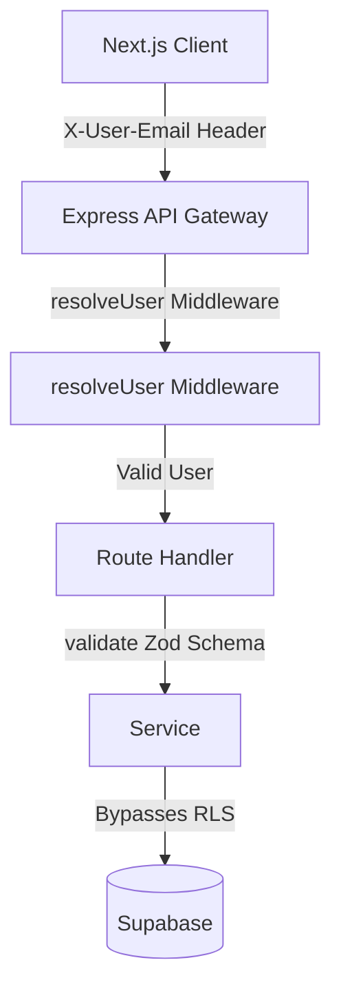

# DocFlow — Technical Architecture & Code Choices

DocFlow is a full-stack document editor built with Next.js, Express, and Supabase. This document outlines the actual system layout, code paths, and engineering trade-offs made during development.

---

## 1. System Topology & Request Flow

Requests are authenticated by resolving the `X-User-Email` header in middleware, which links to a seeded database user. This keeps local testing friction-free while maintaining a strict user context through the Express controller and service layers down to Supabase.

---

## 2. Code Decisions & System Design

### Client-Side Autosave & Race Prevention
- **AbortController Cancellation**: Autosave triggers after a 2-second debounce. If the user continues typing while a save is in-flight, the active HTTP request is immediately canceled using an `AbortController`. This guarantees that out-of-order responses from slow networks cannot overwrite the user's latest content.
- **Transient Error Retry**: If the server returns a 500 error, the client doesn't immediately fail. It triggers up to 3 automated retries (3-second spacing) to handle transient database connection drops or server restarts gracefully.
- **Dynamic Relative Timers**: The save status indicator uses a fixed-width container (`w-[160px]`) that stays permanently mounted. This prevents layout shifts in the toolbar. It transitions through a state machine:
  `idle` (displays relative update time, e.g. "Saved 2m ago") → `unsaved` (amber dot) → `saving` (spinning loader) → `saved` (checkmark) → `error` (red dot).

### Client-Side Markdown Export
- **Why Client-Side?**: Instead of hitting the backend to parse the database representation, we parse the live TipTap JSON state directly in the browser via `exportTipTapToMarkdown`.
- **UX Advantage**: This approach is synchronous, has zero network overhead, and immediately exports the user's *draft* state (including unsaved edits) without forcing them to wait for a database round-trip.

### Role-Based Access Control (RBAC)
- **Role Enforcement**: Access control is enforced at both the UI layer (formatting toolbars hidden, editor set to read-only, title input locked for Viewers) and the Express controller layer.
- **DB Backing**: Collaborative permissions are stored in the `shares` table with `role: 'viewer' | 'editor'`. Ownership is determined solely by the `documents.owner_id` field.
- **API Guarding**:
  - `documentService.getById` joins the shares record to return the calling user's role (`'owner' | 'editor' | 'viewer'`).
  - `documentService.update` rejects save attempts (PATCH) with a `403 FORBIDDEN` if the requesting user's resolved role is `'viewer'`.

---

## 3. Database Schema

### Table: `users`
- `id`: `uuid` (Primary Key)
- `email`: `text` (Unique, Not Null)
- `name`: `text` (Not Null)
- `created_at`: `timestamptz`

### Table: `documents`
- `id`: `uuid` (Primary Key)
- `title`: `text` (Not Null, defaults to "Untitled Document")
- `content_json`: `text` (Nullable stringified TipTap document structure)
- `owner_id`: `uuid` (Foreign Key referencing `users.id`, cascading delete)
- `created_at`: `timestamptz`
- `updated_at`: `timestamptz`

### Table: `shares`
- `id`: `uuid` (Primary Key)
- `document_id`: `uuid` (Foreign Key referencing `documents.id`, cascading delete)
- `user_id`: `uuid` (Foreign Key referencing `users.id`, cascading delete)
- `role`: `text` (Defaults to `'viewer'`, validated as `'viewer' | 'editor'`)
- `created_at`: `timestamptz`
- **Unique Constraint**: `(document_id, user_id)` (prevents duplicate shares)

---

## 4. Scope Decisions & Trade-offs

### Simulated Sessions
- **Decision**: Authenticate solely via the `X-User-Email` header.
- **Trade-off**: Minimal security, but ideal for an evaluation scenario where the reviewer needs to switch profiles (Alice, Bob, Charlie) and instantly verify read/write permission changes.

### No CRDT / WebSocket Sync
- **Decision**: Traditional HTTP autosave instead of Yjs/WebSockets.
- **Trade-off**: Simpler codebase, fast implementation, and less backend state management. Perfect for a single-editor workflow or turn-based collaboration, though concurrent edits would result in last-write-wins.
